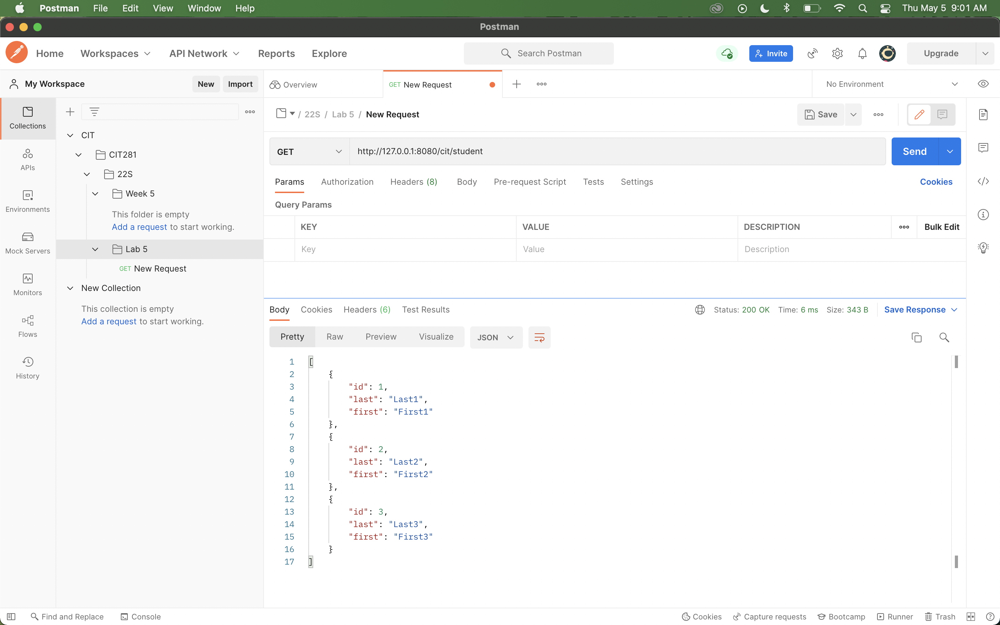
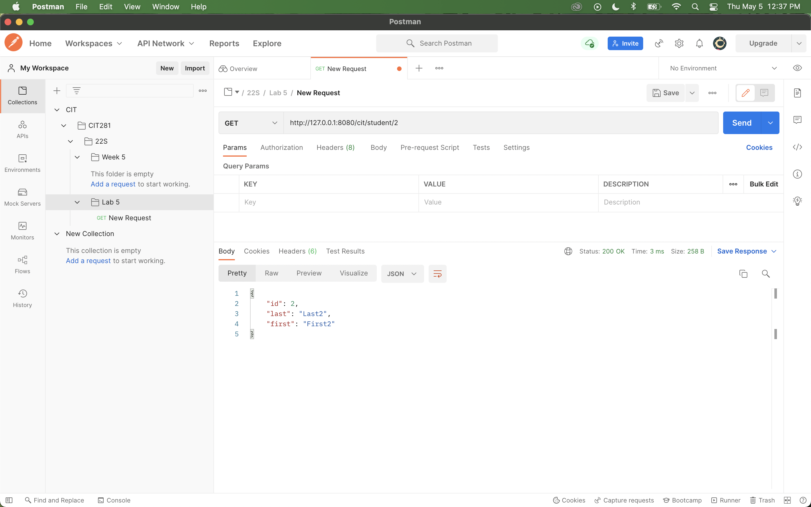
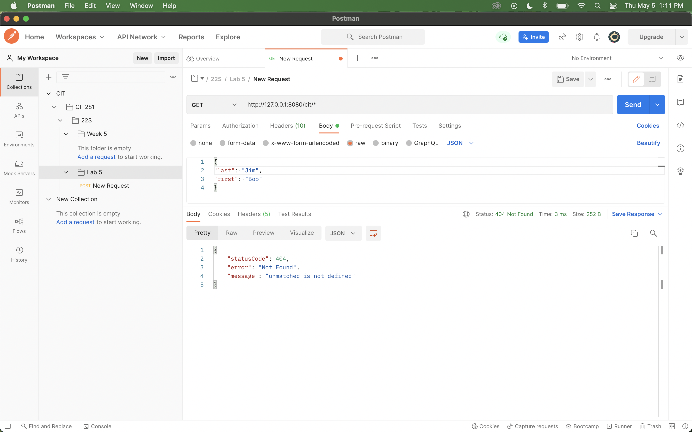
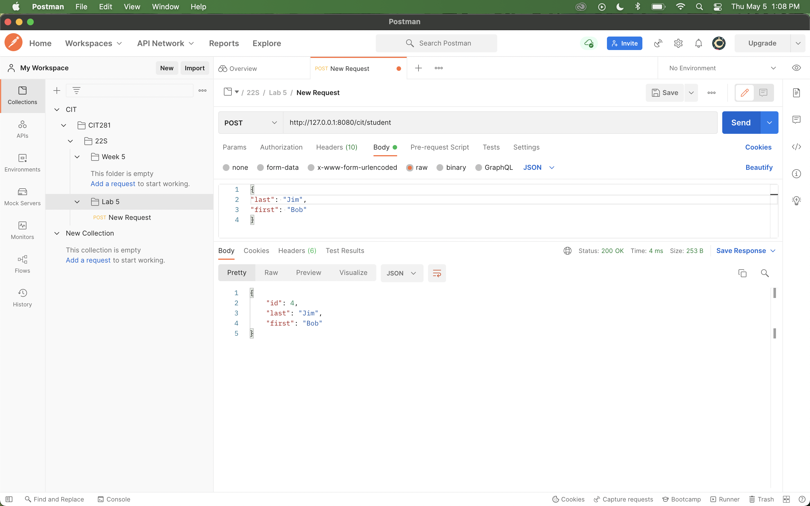

# Lab 5

[RETURN TO HOMEPAGE](https://sierrabakerr.github.io/)

## Lab goals and outcomes:

Part 1: Download and install Postman

Part 2: Create a CIT 281 collection and folders

Part 3: Create a Node.js and fastify server application with GET and respond with JSON

Part 4: Add array of students object

Part 5: Use Postman to test server GET routes

Part 6: Add POST handling to server application and respond with JSON

Part 7: Use Postman and POST request

## Lab Deliverables:

### 1. [fastify-server.js](fastify-server.js)

### 2. [package.json](package.json)

### 3. AllStudent.png

### 4. SingleStudent.png

### 5. Unmatched.png 

### 6. StudentPost.png

